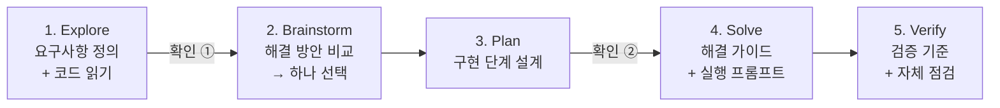

# spec-solved

> 요구사항을 주면 빠진 정보를 묻고, **"이 문제는 이렇게 풀면 된다"**는 해결 가이드와 어떤 코딩 도구에든 그대로 붙여넣을 수 있는 **실행 프롬프트**를 만들어주는 Claude Code 스킬

"기사에게 전달되는 페이정책에 대한 기능을 구현하라" 같은 한 줄짜리 요구사항에는 사용자만 정할 수 있는 규칙이 숨어 있습니다. 지역별 기본료가 다른지, 비 오는 날 할증이 있는지, 거리가 멀면 얼마를 더 주는지 같은 것들이죠. 이걸 AI가 마음대로 정하면 결과물은 그럴듯해 보여도 원하던 것과 다릅니다.

`spec-solved`는 **코드를 직접 고치지 않습니다.** 사용자마다 쓰는 도구(Claude Code, Cursor, Copilot, 다른 에이전트, 직접 코딩)가 다르기 때문입니다. 대신 구현 전에 필요한 모든 것을 해줍니다.

- 요구사항을 정확히 정리하고 숨은 결정사항을 찾아 묻습니다.
- 해결책을 분명하게 제시합니다. 예: "이 중복 배차 문제는 PostgreSQL 조건부 UPDATE로 풀면 됩니다. Redis 락은 필요 없습니다."
- 누가 구현하든 요구사항을 놓칠 수 없도록 가이드, 검증 기준, 실행 프롬프트를 `Solution.md`에 담아 줍니다.

---

## 목차

- [이런 분께 추천합니다](#이런-분께-추천합니다)
- [설치](#설치)
- [사용법](#사용법)
- [동작 방식: 5단계](#동작-방식-5단계)
- [핵심 원칙](#핵심-원칙)
- [결과물: Solution.md](#결과물-solutionmd)
- [예시](#예시)
- [테스트 결과](#테스트-결과)
- [업데이트와 삭제](#업데이트와-삭제)
- [자주 묻는 질문](#자주-묻는-질문)

---

## 이런 분께 추천합니다

| 상황 | 예시 |
|---|---|
| 기업 과제, 코딩 테스트 과제를 받았을 때 | "기사에게 전달되는 페이정책에 대한 기능을 구현하라" |
| 기능 요청이 짧고 애매할 때 | "쿠폰 중복 사용 정책 반영해주세요" |
| 기술적인 문제를 어떻게 풀어야 할지 모를 때 | "여러 기사가 동시에 수락하면 중복 배차가 생겨. 어떻게 해결하면 돼?" |
| 개발을 잘 몰라도 원하는 기능이 있을 때 | "배달앱에서 기사님들 받는 돈 계산하는 기능 만들고 싶어요" |

개발자와 비개발자 모두 쓸 수 있습니다. 질문하고 설명하는 **말투만** 사용자에 맞게 바뀌고, 거치는 단계와 결과물의 구성은 같습니다.

---

## 설치

**필요한 것:** [Claude Code](https://claude.com/claude-code)

### 방법 1. 플러그인으로 설치 (권장)

Claude Code 안에서 아래 두 줄을 차례로 입력하세요.

```
/plugin marketplace add sungseokmin/spec-solved
/plugin install spec-solved@spec-solved
```

터미널에서 설치하고 싶다면 아래 명령을 쓰면 됩니다. 결과는 같습니다.

```bash
claude plugin marketplace add sungseokmin/spec-solved
claude plugin install spec-solved@spec-solved
```

설치한 뒤에는 Claude Code를 다시 시작하세요.

### 방법 2. 스킬 폴더만 직접 복사

플러그인을 쓰지 않고 스킬만 쓰고 싶다면 이렇게 하세요.

```bash
git clone https://github.com/sungseokmin/spec-solved.git
mkdir -p ~/.claude/skills
cp -r spec-solved/skills/spec-solved ~/.claude/skills/
```

> 어떤 방법으로 설치해도 `/spec-solved`로 실행됩니다. 플러그인으로 설치했다면 `/spec-solved:spec-solved`로도 실행할 수 있습니다.

---

## 사용법

### 자동으로 실행

요구사항이나 풀고 싶은 문제를 평소처럼 말하면 Claude가 상황을 보고 스킬을 자동으로 사용합니다.

```
기사에게 전달되는 페이정책에 대한 기능을 구현하라
```

```
배달 주문을 여러 기사가 동시에 수락하면 같은 주문이 두 명한테 배차돼. 서버 3대, PostgreSQL, Redis 쓰는 중이야. 어떻게 해결하면 돼?
```

### 직접 실행

스킬을 확실하게 쓰고 싶다면 명령어 뒤에 요구사항을 붙이세요.

```
/spec-solved 기사에게 전달되는 페이정책에 대한 기능을 구현하라
```

### 받은 결과로 구현하기

1. 스킬이 만든 `Solution.md`를 열어 해결 방법과 검증 기준을 확인합니다.
2. 맨 아래 **실행 프롬프트**를 복사합니다. 대화창에도 같은 프롬프트가 나옵니다.
3. 평소 쓰는 도구(Claude Code, Cursor, 다른 에이전트)에 붙여넣거나 개발자에게 전달합니다.
4. 구현이 끝나면 `Solution.md`의 검증 기준(V1, V2, …)으로 결과를 확인합니다.

### 사용 팁

- **프로젝트 폴더에서 실행하세요.** 기존 코드가 있으면 스킬이 코드를 읽고(수정하지 않음), 실제 파일과 클래스 이름을 근거로 가이드와 프롬프트를 만듭니다.
- **이미 정해진 규칙은 처음부터 알려주세요.** 요구사항에 정책이 다 들어 있으면 질문 없이 바로 결과물을 만듭니다.
- **작은 수정도 됩니다.** "에러 메시지를 ○○로 바꿔줘" 같은 요청에는 고칠 위치(파일과 줄 번호), 짧은 실행 프롬프트, 확인 방법만 간단히 줍니다.

---

## 동작 방식: 5단계



| 단계 | 하는 일 | 사용자에게 보여주는 것 |
|---|---|---|
| **1. Explore** | 요구사항을 정리하고, 기존 코드를 읽고, 사용자가 정해야 할 규칙을 찾아 질문합니다 | 요구사항 목록(R1, R2, …), 제약 조건, 질문 |
| **확인 ①** | 정리한 요구사항 목록이 맞는지 확인받습니다 | |
| **2. Brainstorm** | 실제로 다른 해결 방안 2~3개를 비교하고 **하나를 분명히 고릅니다** | 제안, Trade-Off |
| **3. Plan** | 구현 단계를 나누고, 단계마다 어떤 파일을 다루고 어떤 요구사항(R-ID)을 해결하는지 정합니다 | 계획 |
| **확인 ②** | 선택한 방안과 계획으로 진행해도 되는지 확인받습니다 | |
| **4. Solve** | 해결 가이드(핵심 스니펫 포함)와, 어떤 도구에도 쓸 수 있는 실행 프롬프트를 작성합니다 | `Solution.md`, 실행 프롬프트 |
| **5. Verify** | 요구사항마다 확인 방법을 만들고, 가이드가 요구사항을 빠짐없이 다루는지 스스로 점검합니다 | 검증 기준, 발견된 예외사항, 자체 점검 결과 |

> "어떻게 해결하면 돼?"처럼 해결책을 묻는 질문에는 **첫 답변에서 해결 방향부터** 제시합니다. 그다음 그 방향을 바꿀 수 있는 질문만 이어서 합니다.

---

## 핵심 원칙

### 1. 코드를 고치지 않습니다

스킬은 프로젝트 코드를 읽기만 하고 `Solution.md` 하나만 작성합니다. 구현은 사용자가 자기 도구로 합니다. 그래서 어떤 개발 환경에서도 같은 방식으로 쓸 수 있습니다.

### 2. 질문은 중립적으로, 해결책은 분명하게

**사용자가 정할 정책**(요금, 할증, 권한 등)을 물을 때는 선택지에 "추천"을 붙이지 않습니다. 추천이 보이면 사람은 자기가 실제로 원하는 것보다 추천을 고르기 쉽기 때문입니다. 대신 선택지마다 고르면 어떤 결과가 생기는지를 같은 비중으로 보여주고, 직접 답할 수 있는 칸을 항상 둡니다.

```
Q2. 거리가 멀어지면 페이를 어떻게 늘릴까요?
- (a) 구간별 정액: 요금표로 보여주기 쉽지만, 구간 경계에서 금액이 계단처럼 바뀝니다.
- (b) 거리 비례: 거리에 정확히 비례하지만, 금액이 둥근 숫자로 떨어지지 않습니다.
- (c) 거리 할증 없음: 기본료만 지급합니다.
- (d) 직접 입력: ____
```

반대로 **기술적인 해결책**은 전문가로서 하나를 분명히 제시합니다. 이유를 설명하고, 고르지 않은 대안과 Trade-Off도 함께 보여줍니다.

"알아서 해줘"라고 맡기면 무엇이 더 중요한지(단순함, 공정함, 비용 등)를 먼저 묻고, 그 기준으로 정한 뒤 **가정**으로 기록합니다.

### 3. 정보의 출처를 표시합니다

모든 정보에 출처가 붙습니다. 추측을 사실처럼 쓰지 않습니다.

| 표시 | 의미 |
|---|---|
| `사용자 확인` | 사용자가 직접 말하거나 고른 내용 |
| `코드 확인` | 프로젝트 코드에서 확인한 내용 |
| `가정` | 사용자가 결정을 맡겨서 스킬이 정한 내용 (언제든 바꿀 수 있음) |

### 4. 요구사항 ID로 끝까지 추적합니다

요구사항마다 R1, R2, … ID를 붙이고, 계획·가이드·실행 프롬프트·검증 기준이 모두 이 ID를 가리킵니다. 넘기기 전에 스스로 점검하는 항목은 이렇습니다.

- 모든 요구사항이 계획, 가이드, 실행 프롬프트, 검증 기준에 빠짐없이 들어갔는지
- 사용자가 정한 값이 바뀌지 않고 그대로 들어갔는지
- 언급한 파일, 클래스, 필드가 실제 코드에 있는지
- 계산 예시가 맞는지

### 5. 사용자 언어를 따릅니다

한국어로 요청하면 질문, 답변, `Solution.md`, 실행 프롬프트가 모두 한국어로 작성됩니다. 영어로 요청하면 영어로 작성됩니다.

---

## 결과물: Solution.md

요구사항 목록이 확정되면 프로젝트 폴더에 `Solution.md`를 만듭니다.

| 섹션 | 내용 |
|---|---|
| 1. 요구사항 확인 | 원문과 R-ID별 요구사항, 출처 |
| 2. 제약 조건 | 기술 스택, 비즈니스 규칙, 범위에서 뺀 것 |
| 3. 결정 & 가정 | 질문과 답, 각 결정의 출처 |
| 4. 해결 방법 | 한 줄 요약, 고른 이유, 검토한 대안과 Trade-Off |
| 5. 계획 | 구현 단계, 다루는 파일, R-ID, 검증 기준 |
| 6. 해결 가이드 | 기존 코드와 맞추는 법, 정책 값을 둘 위치, 엣지 케이스, 핵심 스니펫 |
| 7. 검증 기준 | V-ID별 입력 시나리오와 기대 결과 |
| 8. 발견된 예외사항 | 예외, 영향, 처리 방법 |
| 9. 자체 점검 | 요구사항 누락, 값 불일치, 존재하지 않는 코드 참조 여부 |
| 10. 실행 프롬프트 | 어떤 도구에든 붙여넣을 수 있는 완결된 프롬프트 |

> 같은 폴더에 다른 용도의 `Solution.md`가 이미 있으면 덮어쓰기 전에 먼저 물어봅니다.

---

## 예시

### 예시 1. 기술 문제: 중복 배차

**요청:** `여러 기사가 동시에 수락하면 같은 주문이 두 명한테 배차돼. 서버 3대, PostgreSQL, Redis 쓰는 중이야. 어떻게 해결하면 돼?`

**첫 답변에서 해결 방향부터 제시합니다.**

> **PostgreSQL에서 "조건부 UPDATE 한 번"으로 배차를 끝내세요. Redis 분산 락은 필요 없습니다.**
>
> ```sql
> UPDATE orders
>    SET rider_id = :rider_id, status = 'picked_up'
>  WHERE id = :order_id
>    AND status = 'pending'
>    AND rider_id IS NULL;
> -- 영향받은 행 수가 1이면 배차 성공, 0이면 "이미 다른 기사가 수락함"
> ```
>
> - 서버가 3대여도 최종 판정은 DB 한 곳에서 일어나서, 두 번째 기사는 항상 0행을 받습니다.
> - Redis 락은 락 만료, 네트워크 지연, 장애 시 정합성이 깨질 수 있고, 결국 DB에도 조건 검사가 필요합니다.
> - 지금 코드는 `assign()`이 주문 상태를 확인하지 않고 덮어쓰는 게 직접 원인입니다. `코드 확인`

이어서 해결 방향을 바꿀 수 있는 질문만 합니다. 예를 들어 선착순 수락인지, 서버가 기사를 골라 배정하는지, 기사 한 명이 동시에 맡을 수 있는 주문 수에 제한이 있는지 같은 것들입니다.

### 예시 2. 기업 과제: 배달 기사 페이 정책

**요청:** `기사에게 전달되는 페이정책에 대한 기능을 구현하라`

**1) 코드 읽기:** 기존 코드에서 활용할 수 있는 것과 없는 것을 먼저 확인합니다.

```
- Order에 region(예: SEOUL_GANGNAM), distance_m(도로 거리), status 등이 있음  [코드 확인]
- cancel()은 픽업 후에도 주문을 취소할 수 있음                                [코드 확인]
- 페이 관련 코드와 날씨 정보는 아직 없음                                      [코드 확인]
```

**2) 숨은 결정사항 질문:** 계산 방식을 좌우하는 것부터 한 번에 최대 5개씩 묻습니다.

```
Q1. 기본료는 어떻게 정할까요?           (전국 동일 / 지역별 / 직접 입력)
Q2. 거리가 멀어지면 페이를 어떻게?      (구간별 정액 / 거리 비례 / 없음 / 직접 입력)
Q3. 거리 말고 붙일 할증이 있나요?       (시간대 / 날씨 / 공휴일 / 없음 / 직접 입력)
Q4. 취소된 주문은 어떻게 할까요?        (0원 / 픽업 후 취소는 일부 지급 / 직접 입력)
```

**3) 답변을 받은 뒤:** 검증 기준과 실행 프롬프트를 만듭니다. 아래는 강남 3,500원, 그 외 3,000원, 비 +500원, 3km 초과 시 1km당 +300원(올림), 취소 0원으로 답했을 때의 실제 결과 중 일부입니다.

| ID | 시나리오 | 기대 결과 |
|---|---|---|
| V4 | 마포, 맑음, 3,000m | 3,000원 (정확히 3km는 할증 없음) |
| V5 | 마포, 맑음, 3,001m | 3,300원 (1m만 넘어도 1km로 올림) |
| V8 | 마포, 비, 10,000m | 3,000 + 500 + 7×300 = 5,600원 |
| V9 | 강남, 비, 5,000m, 취소 | 0원 |

```text
## 목표
Python 배달 플랫폼 백엔드에 배달기사 1건당 페이를 계산하는 RiderPayService 를 추가하고 단위 테스트를 작성한다.

## 컨텍스트
- Python 3, 표준 라이브러리만 사용. 테스트: python3 -m unittest discover -s tests
- app/models.py: OrderStatus(PENDING, PICKED_UP, DELIVERED, CANCELLED), Region(code, name),
  Order(id, region, distance_m(도로 거리, 미터), food_price, created_at, status, rider_id, delivered_at)

## 확정 규칙
- R2: 기본료 — region.code == "SEOUL_GANGNAM" 이면 3500, 그 외 3000
- R4: distance_m 이 3000 이하이면 거리 할증 0. 초과분을 1000m 단위로 올림한 km 수 × 300
- R5: status == CANCELLED 이면 0
  ...

## 제약
- app/models.py, app/order_service.py, 기존 테스트는 수정하지 않는다.

## 완료 조건
- V1~V12 시나리오를 각각 테스트로 작성해 모두 통과
- 완료 후 생성/수정한 파일 목록과 테스트 실행 결과를 보고한다.
```

**4) 발견된 예외사항**

| # | 예외 | 영향 | 처리 방법 |
|---|---|---|---|
| E1 | 배달 완료된 주문도 취소 처리가 가능함 | 이미 배달한 기사의 페이가 0원이 될 수 있음 | 완료 후 취소를 막을지 사용자에게 결정 요청 |

---

## 테스트 결과

예제 배달앱 프로젝트에서 5가지 상황을 실행해 확인했습니다. (Claude Code, 상황별 1회 실행)

| 상황 | 확인한 것 | 결과 |
|---|---|---|
| 비개발자, 정보가 부족한 요청 | 쉬운 말로 추천 없는 질문 5개, 파일 생성 없음 | ✅ |
| 실제 기업과제 "페이정책 구현" | 코드를 근거로 R1~R7 정리, 추천 없는 질문 4개 | ✅ |
| 개발자, 정책을 모두 알려주며 "구현해줘" | 코드는 수정하지 않고 가이드, 검증 기준 13개, 실행 프롬프트 작성 | ✅ |
| 작은 수정 (에러 메시지 변경) | 수정 위치(파일과 줄 번호), 짧은 프롬프트, 확인 방법 제시 | ✅ |
| 기술 문제 "중복 배차 어떻게 해결해?" | 첫 답변에서 해결 방향(조건부 UPDATE)과 이유 제시 | ✅ |

5가지 상황 모두에서 프로젝트 코드는 한 줄도 바뀌지 않았고, 선택지에 "추천"이 붙은 질문도 없었습니다. 테스트 수가 적으므로 참고용으로만 봐주세요.

**자동 실행 정확도:** 요청 20개(실행돼야 하는 요청 10개, 실행되면 안 되는 요청 10개)를 각각 3번씩 돌려서, 스킬이 필요한 상황에서만 자동으로 실행되는지 확인했습니다. 결과는 **19/20 통과**입니다. 버그 수정, 코드 리뷰, README 정리처럼 스킬이 필요 없는 요청에서는 한 번도 실행되지 않았습니다. 통과하지 못한 1개는 "PRD 써줘"였습니다. PRD 작성은 이 스킬의 대상이 아닙니다.

---

## 업데이트와 삭제

```bash
# 최신 버전으로 업데이트
claude plugin marketplace update spec-solved

# 삭제
claude plugin uninstall spec-solved@spec-solved
claude plugin marketplace remove spec-solved
```

---

## 자주 묻는 질문

**Q. 왜 코드를 직접 고쳐주지 않나요?**
사용자마다 쓰는 개발 도구와 작업 방식이 다르기 때문입니다. 이 스킬은 "무엇을, 어떻게, 어떤 기준으로 확인할지"를 정확하게 정하는 데 집중합니다. 구현은 실행 프롬프트를 받아 원하는 도구로 하면 됩니다.

**Q. 실행 프롬프트는 어디에 쓰나요?**
Claude Code, Cursor, Copilot, 다른 AI 에이전트 등 어디에든 붙여넣을 수 있습니다. 특정 도구의 명령어 없이 목표, 컨텍스트, 확정 규칙, 단계, 제약, 완료 조건으로만 구성되어 있습니다. 개발자에게 작업 지시서로 전달해도 됩니다.

**Q. 질문이 너무 많지 않나요?**
한 번에 최대 4~5개만 묻고, 결과에 가장 큰 영향을 주는 것부터 묻습니다. 처음 요청에 규칙을 자세히 적을수록 질문은 줄어듭니다.

**Q. 코드가 없는 빈 폴더에서도 되나요?**
됩니다. 코드 읽기 단계를 건너뛰고, 처음부터 만드는 기준으로 가이드와 프롬프트를 작성합니다.

**Q. 어떤 언어나 프레임워크를 지원하나요?**
특정 언어에 묶여 있지 않습니다. 프로젝트에 있는 기존 코드의 방식과 테스트 도구를 기준으로 가이드를 만듭니다.

---

## 구조

```
spec-solved/
├── .claude-plugin/
│   ├── plugin.json            # 플러그인 정보
│   └── marketplace.json       # 마켓플레이스 정보
├── skills/spec-solved/
│   ├── SKILL.md               # 5단계 흐름과 원칙
│   └── references/
│       ├── question-guide.md      # 숨은 결정사항을 찾고 묻는 방법
│       └── solution-template.md   # Solution.md 양식과 실행 프롬프트 작성법
├── LICENSE
└── README.md
```

## 라이선스

[MIT](./LICENSE) © sungseokmin

---

<details>
<summary><b>English</b></summary>

**spec-solved** is a Claude Code skill that turns a requirement into a clear solution you can hand to any coding tool. It never edits your code. It reads the codebase, finds the hidden decisions in a short requirement (pricing, policies, permissions), and asks you about them neutrally, with no "recommended" option, so the answers reflect your actual goal. Then it picks a clear technical solution with its trade-offs (e.g., "use a conditional UPDATE in PostgreSQL; no Redis lock needed"). It writes `Solution.md` with a solution guide, per-requirement verification criteria, a self-check, and a self-contained execution prompt you can paste into Claude Code, Cursor, another agent, or hand to a developer. It replies in the language you write in.

```
/plugin marketplace add sungseokmin/spec-solved
/plugin install spec-solved@spec-solved
```

Run it with `/spec-solved <your requirement>`, or just describe the requirement and Claude will pick it up.

</details>
