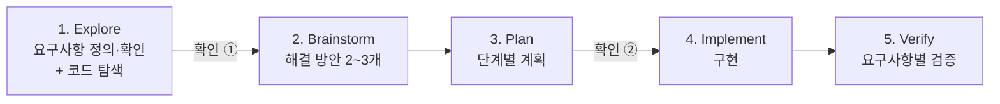

# spec-solved

> 요구사항을 받으면, 빠진 정보를 묻고 → 계획하고 → 구현하고 → 요구사항 하나하나가 충족됐는지 검증까지 해주는 **Claude Code 스킬**

"기사에게 전달되는 페이정책에 대한 기능을 구현하라" 같은 한 줄짜리 요구사항에는 사용자만 정할 수 있는 규칙이 숨어 있습니다. 지역별 기본료가 다른지, 비 오는 날 할증이 있는지, 거리가 멀면 얼마를 더 주는지 같은 것들이죠. 이걸 AI가 마음대로 정하면 결과물은 그럴듯해 보여도 원하던 것과 다릅니다.

`spec-solved`는 이런 **숨은 결정사항을 먼저 찾아서 묻고**, 확정된 요구사항마다 ID를 붙여 **계획 → 구현 → 검증까지 하나도 빠짐없이 추적**합니다. 모든 과정은 `Solution.md` 문서로 남습니다.

---

## 목차

- [이런 분께 추천합니다](#이런-분께-추천합니다)
- [설치](#설치)
- [사용법](#사용법)
- [동작 방식: 5단계](#동작-방식-5단계)
- [핵심 원칙](#핵심-원칙)
- [결과물: Solution.md](#결과물-solutionmd)
- [예시: 배달 기사 페이 정책](#예시-배달-기사-페이-정책)
- [테스트 결과](#테스트-결과)
- [업데이트와 삭제](#업데이트와-삭제)
- [자주 묻는 질문](#자주-묻는-질문)

---

## 이런 분께 추천합니다

| 상황 | 예시 |
|---|---|
| 기업 과제, 코딩 테스트 과제를 받았을 때 | "기사에게 전달되는 페이정책에 대한 기능을 구현하라" |
| 기능 요청이 짧고 애매할 때 | "쿠폰 기능 만들어줘", "정산 기능 추가해줘" |
| 요구사항을 하나도 놓치면 안 될 때 | 과제 채점, 고객 요청, 돈·권한·정책이 걸린 기능 |
| 개발을 잘 몰라도 원하는 기능이 있을 때 | "배달앱에서 기사님들 받는 돈 계산하는 기능 만들고 싶어요" |

개발자와 비개발자 모두 쓸 수 있습니다. 질문하는 **말투만** 사용자에 맞게 바뀌고, 거치는 단계와 검증 기준은 같습니다.

---

## 설치

**필요한 것:** [Claude Code](https://claude.com/claude-code)

### 방법 1. 플러그인으로 설치 (권장)

Claude Code 안에서 아래 두 줄을 차례로 입력하세요.

```
/plugin marketplace add sungseokmin/spec-solved
/plugin install spec-solved@spec-solved
```

터미널에서 설치하고 싶다면 아래 명령을 쓰면 됩니다. 결과는 같습니다.

```bash
claude plugin marketplace add sungseokmin/spec-solved
claude plugin install spec-solved@spec-solved
```

설치한 뒤에는 Claude Code를 다시 시작하세요.

### 방법 2. 스킬 폴더만 직접 복사

플러그인을 쓰지 않고 스킬만 쓰고 싶다면 이렇게 하세요.

```bash
git clone https://github.com/sungseokmin/spec-solved.git
mkdir -p ~/.claude/skills
cp -r spec-solved/skills/spec-solved ~/.claude/skills/
```

> 어떤 방법으로 설치해도 `/spec-solved`로 실행됩니다. 플러그인으로 설치했다면 `/spec-solved:spec-solved`로도 실행할 수 있습니다.

---

## 사용법

### 자동으로 실행

요구사항을 평소처럼 말하면 Claude가 상황을 보고 스킬을 자동으로 사용합니다.

```
기사에게 전달되는 페이정책에 대한 기능을 구현하라
```

```
이 과제 요구사항 해결해줘: 회원 등급별 할인 기능을 구현하시오
```

### 직접 실행

스킬을 확실하게 쓰고 싶다면 명령어 뒤에 요구사항을 붙이세요.

```
/spec-solved 기사에게 전달되는 페이정책에 대한 기능을 구현하라
```

### 사용 팁

- **프로젝트 폴더에서 실행하세요.** 기존 코드가 있으면 스킬이 먼저 코드를 살펴보고, 그 구조와 규칙에 맞춰 질문하고 구현합니다.
- **이미 정해진 규칙은 처음부터 알려주세요.** 요구사항에 정책이 다 들어 있으면 질문 없이 바로 진행합니다.
  ```
  RiderPayService 구현해줘. 정책: 강남 3500원, 그 외 3000원, 비 오는 날 +500원,
  3km 초과 시 1km당 +300원(올림), 취소 주문은 0원. 질문 없이 진행해도 돼.
  ```
- **작은 수정은 바로 처리합니다.** "에러 메시지를 ○○로 바꿔줘" 같은 요청은 질문 없이 바로 고치고, 함께 살펴볼 점이 있으면 끝에 알려줍니다.

---

## 동작 방식: 5단계



| 단계 | 하는 일 | 사용자에게 보여주는 것 |
|---|---|---|
| **1. Explore** | 요구사항을 정리하고, 기존 코드를 살펴보고, 사용자가 정해야 할 규칙을 찾아 질문합니다 | 요구사항 목록(R1, R2, …), 제약 조건, 질문 |
| **확인 ①** | 정리한 요구사항 목록이 맞는지 사용자에게 확인받습니다 | |
| **2. Brainstorm** | 실제로 다른 해결 방안 2~3개를 비교합니다 | 제안, Trade-Off |
| **3. Plan** | 각 단계가 어떤 요구사항(R-ID)을 다루고 어떻게 검증할지 정합니다 | 계획 |
| **확인 ②** | 계획대로 진행해도 되는지 확인받습니다 | |
| **4. Implement** | 기존 코드의 방식을 따라 구현합니다. 금액, 기준값 같은 정책은 한곳에 모아둡니다 | 구현 결과 |
| **5. Verify** | 요구사항마다 테스트, 실행 결과, 계산 예시 같은 근거를 제시합니다 | 검증표, 발견된 예외사항과 해결법 |

---

## 핵심 원칙

### 1. 추천하지 않고 묻습니다

질문의 선택지에 "추천"을 붙이지 않습니다. 추천이 보이면 사람은 자기가 실제로 원하는 것보다 추천을 고르기 쉽기 때문입니다. 대신 **선택지마다 고르면 어떤 결과가 생기는지**를 같은 비중으로 보여주고, 직접 답할 수 있는 칸을 항상 둡니다.

```
Q2. 거리가 멀어지면 페이를 어떻게 늘릴까요?
- (a) 구간별 정액: 요금표로 보여주기 쉽지만, 구간 경계에서 금액이 계단처럼 바뀝니다.
- (b) 거리 비례: 거리에 정확히 비례하지만, 금액이 둥근 숫자로 떨어지지 않습니다.
- (c) 거리 할증 없음: 기본료만 지급합니다.
- (d) 직접 입력: ____
```

"알아서 해줘"라고 맡기면 무엇이 더 중요한지(단순함, 공정함, 비용 등)를 먼저 묻고, 그 기준으로 정한 뒤 **가정**으로 기록합니다.

### 2. 정보의 출처를 표시합니다

모든 정보에 출처가 붙습니다. 추측을 사실처럼 쓰지 않습니다.

| 표시 | 의미 |
|---|---|
| `사용자 확인` | 사용자가 직접 말하거나 고른 내용 |
| `코드 확인` | 프로젝트 코드에서 확인한 내용 |
| `가정` | 사용자가 결정을 맡겨서 스킬이 정한 내용 (언제든 바꿀 수 있음) |

### 3. 요구사항 ID로 끝까지 추적합니다

요구사항마다 R1, R2, … ID를 붙이고, 계획·구현·검증이 모두 이 ID를 가리킵니다. 계획이나 검증이 없는 요구사항이 있으면 다음 단계로 넘어가지 않습니다. 이렇게 해서 "요청한 것 / 계획한 것 / 만든 것 / 검증한 것" 사이에 어긋나는 부분이 없게 합니다.

### 4. 사용자 언어를 따릅니다

한국어로 요청하면 질문, 답변, `Solution.md`가 모두 한국어로 작성됩니다. 영어로 요청하면 영어로 작성됩니다.

---

## 결과물: Solution.md

요구사항 목록이 확정되면 프로젝트 폴더에 `Solution.md`를 만들고, 단계가 진행될 때마다 갱신합니다. 언제 열어봐도 현재 진행 상황을 볼 수 있습니다.

| 섹션 | 내용 |
|---|---|
| 1. 요구사항 확인 | 원문과 R-ID별 요구사항, 출처 |
| 2. 제약 조건 | 기술 스택, 비즈니스 규칙, 범위에서 뺀 것 |
| 3. 결정 & 가정 | 질문과 답, 각 결정의 출처 |
| 4. 제안 & Trade-Off | 방안별 장단점과 선택한 이유 |
| 5. 계획 | 단계, 다루는 R-ID, 검증 방법 |
| 6. 구현 요약 | 변경한 파일, 정책 값이 있는 위치 |
| 7. 검증 | R-ID별 ✅ / ⚠️ / ❌ 와 근거 |
| 8. 발견된 예외사항 | 예외, 영향, 해결법 |

> 같은 폴더에 다른 용도의 `Solution.md`가 이미 있으면 덮어쓰기 전에 먼저 물어봅니다.

---

## 예시: 배달 기사 페이 정책

**요청:** `기사에게 전달되는 페이정책에 대한 기능을 구현하라`

**1) 코드 탐색** — 기존 코드에서 활용할 수 있는 것과 없는 것을 먼저 확인합니다.

```
- Order에 region(예: SEOUL_GANGNAM), distance_m(도로 거리), status 등이 있음  [코드 확인]
- cancel()은 픽업 후에도 주문을 취소할 수 있음                                [코드 확인]
- 페이 관련 코드와 날씨 정보는 아직 없음                                      [코드 확인]
```

**2) 숨은 결정사항 질문** — 계산 방식을 좌우하는 것부터 한 번에 최대 5개씩 묻습니다.

```
Q1. 기본료는 어떻게 정할까요?           (전국 동일 / 지역별 / 직접 입력)
Q2. 거리가 멀어지면 페이를 어떻게?      (구간별 정액 / 거리 비례 / 없음 / 직접 입력)
Q3. 거리 말고 붙일 할증이 있나요?       (시간대 / 날씨 / 공휴일 / 없음 / 직접 입력)
Q4. 기사 페이에서 빼는 금액이 있나요?   (없음 / 정률 / 건당 정액 / 직접 입력)
Q5. 취소된 주문은 어떻게 할까요?        (0원 / 픽업 후 취소는 일부 지급 / 직접 입력)
```

**3) 답변 후 구현과 검증** — Solution.md의 검증표 예시입니다.

| ID | 결과 | 근거 |
|----|------|------|
| R1 | ✅ | `test_base_fee_gangnam`: 강남, 2km → 3,500원 |
| R3 | ✅ | `test_distance_boundaries`: 3,000m → 3,000원 / 3,001m → 3,300원 / 4,001m → 3,600원 |
| R4 | ✅ | `test_cancelled_is_zero`: 강남·비·5km여도 취소면 0원 |

**4) 발견된 예외사항**

| # | 예외 | 영향 | 해결법 |
|---|---|---|---|
| E1 | 배달 완료된 주문도 취소 처리가 가능함 | 이미 배달한 기사의 페이가 0원이 될 수 있음 | 완료 후 취소를 막을지 사용자에게 결정 요청 |

---

## 테스트 결과

같은 요청을 스킬을 쓴 경우와 쓰지 않은 경우로 나눠 실행하고, 미리 정한 체크 항목으로 채점했습니다. (Claude Code, 테스트 4개, 각 1회 실행)

| 테스트 | 스킬 사용 | 스킬 미사용 |
|---|---|---|
| 비개발자, 정보가 부족한 요청 | 6/6 | 4/6 |
| 실제 기업 과제 "페이정책 구현" (기존 코드 있음) | 6/6 | 3/6 |
| 개발자, 정책을 모두 알려준 요청 | 5/5 | 3/5 |
| 작은 수정 (에러 메시지 변경) | 4/4 | 4/4 |
| **전체 통과율** | **100%** | **69%** |

스킬을 쓰지 않았을 때 주로 빠진 항목은 요구사항 ID 정리, 선택지별 결과 설명, 요구사항 목록 확인, `Solution.md` 기록이었습니다. 테스트 수가 적으므로 참고용으로만 봐주세요.

---

## 업데이트와 삭제

```bash
# 최신 버전으로 업데이트
claude plugin marketplace update spec-solved

# 삭제
claude plugin uninstall spec-solved@spec-solved
claude plugin marketplace remove spec-solved
```

---

## 자주 묻는 질문

**Q. 질문이 너무 많지 않나요?**
한 번에 최대 4~5개만 묻고, 계산 방식에 가장 큰 영향을 주는 것부터 묻습니다. 처음 요청에 규칙을 자세히 적을수록 질문은 줄어듭니다.

**Q. 코드가 없는 빈 폴더에서도 되나요?**
됩니다. 코드 탐색 단계를 건너뛰고 새로 만드는 것으로 진행합니다. 결과물을 계산 기능만 받을지, 화면까지 받을지도 함께 묻습니다.

**Q. 어떤 언어나 프레임워크를 지원하나요?**
특정 언어에 묶여 있지 않습니다. 프로젝트에 있는 기존 코드의 방식과 테스트 도구를 그대로 따릅니다.

**Q. claude.ai 웹에서도 쓸 수 있나요?**
코드 탐색, 구현, 테스트 실행을 전제로 만든 스킬이라 Claude Code를 대상으로 합니다.

---

## 구조

```
spec-solved/
├── .claude-plugin/
│   ├── plugin.json            # 플러그인 정보
│   └── marketplace.json       # 마켓플레이스 정보
├── skills/spec-solved/
│   ├── SKILL.md               # 5단계 흐름과 원칙
│   └── references/
│       ├── question-guide.md      # 숨은 결정사항을 찾고 묻는 방법
│       └── solution-template.md   # Solution.md 양식
├── LICENSE
└── README.md
```

## 라이선스

[MIT](./LICENSE) © sungseokmin

---

<details>
<summary><b>English</b></summary>

**spec-solved** is a Claude Code skill that turns any requirement into a verified solution. It finds the hidden decisions in a short requirement (pricing, policies, permissions), asks you about them neutrally with no "recommended" option so the answers reflect your actual goal, then traces every requirement by ID through Brainstorm → Plan → Implement → Verify. Everything is recorded in `Solution.md`. It replies in the language you write in.

```
/plugin marketplace add sungseokmin/spec-solved
/plugin install spec-solved@spec-solved
```

Run it with `/spec-solved <your requirement>`, or just describe the requirement and Claude will pick it up.

</details>
